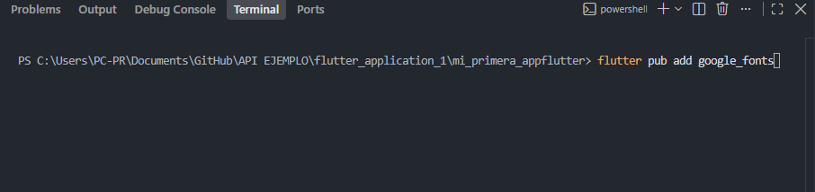
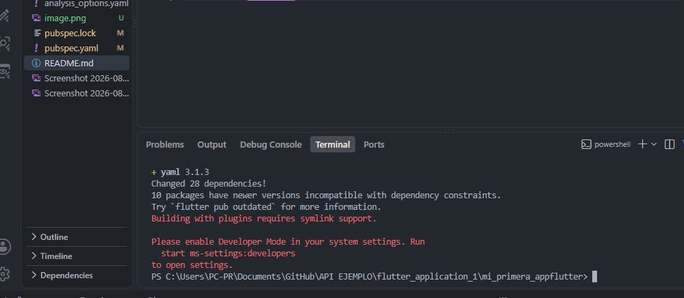

# mi_primera_appflutter

A new Flutter project.

## Descripcion

Aplicación desarrollada en Flutter que muestra un perfil personal, 
demostrando el uso de widgets básicos, un paquete externo (google_fonts) 
y su ejecución en un emulador Android.

## Aautor 
Sebastian Avila
## Tecnologías utilizadas
- Flutter
- Dart
- Visual Studio Code
- Google Fonts (paquete externo)

## Instalacion de Fkutter 

Instalamos el paquete flutter pub add google.fonts 

agregamos el google fonts anuestro pubspec.yaml

agregamos el google fonts anuestro pubspec.yaml

Resultado 
