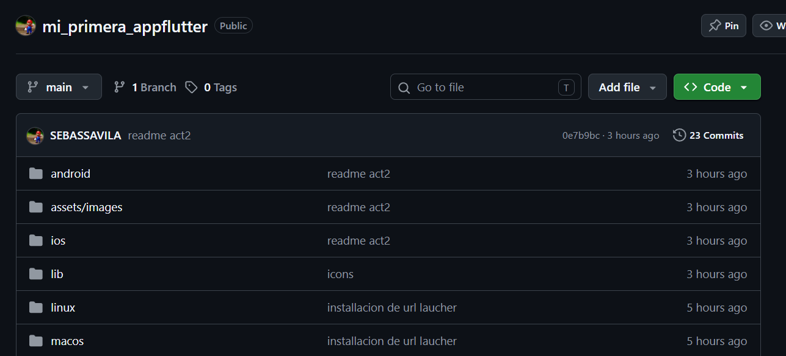

# Mi Perfil Personal - Flutter

## Continuacion Actividad Integradora 1-2
#  Mi Primera App en Flutter

Aquí presento mi primer proyecto desarrollado con **Flutter**, una aplicación organizada por pantallas con estructura de carpetas clara y recursos visuales.

## Estructura del Proyecto
El proyecto cuenta con una organización ordenada, separando las pantallas, estilos, widgets y recursos:

- `lib/screens/`: Aquí se encuentran las distintas pantallas de la aplicación.
- `assets/images/`: Almacena recursos visuales como la imagen de perfil.
- `lib/theme/`: Definición de colores y estilos personalizados.
- `lib/widgets/`: Componentes reutilizables de la interfaz.

-

##  Código de Pantalla de Contacto
En la pantalla de contacto se implementan botones personalizados con íconos, estilos de colores y fuentes personalizadas usando Google Fonts:
 

Se creó un método privado `_botonContacto` para reutilizar el diseño del botón, recibiendo ícono, texto y acción al presionarlo como parámetros.

##  Configuración en pubspec.yaml
Se declaran las dependencias necesarias y los recursos de la aplicación. Aquí se configura `url_launcher` para abrir enlaces, correos y llamadas desde la app:

Además se registra la imagen de perfil dentro de la sección `assets` para poder utilizarla desde el código.

## Instalación de Dependencias
Ejecutando el comando `flutter pub add url_launcher` se descargan y configuran automáticamente los paquetes necesarios para cada plataforma (Linux, macOS, Web, Windows):
 

El terminal muestra el progreso de descarga y las versiones instaladas de cada paquete.

##  Pantalla Principal y Diseño Visual
La pantalla principal contiene botones interactivos con estilos personalizados: colores de fondo, bordes redondeados, espaciados y fuentes de Google Fonts. Al presionar un botón se muestra u oculta información personal:

A la derecha se previsualiza el resultado final en dispositivo móvil: una tarjeta con imagen de perfil, nombre y descripción del estudiante.

## Estructura Simplificada
Resumen de las carpetas principales que conforman el proyecto:

- `screens/` → Pantallas de la aplicación
- `theme/` → Colores y temas
- `widgets/` → Componentes reutilizables
- `main.dart` → Punto de entrada de la app

##  Ejecución y Resultado
La aplicación se compila y ejecuta correctamente. En la consola se confirma que al presionar el botón se dispara la acción programada, mostrando el mensaje: *"Ha presionado el botón"*:

 

