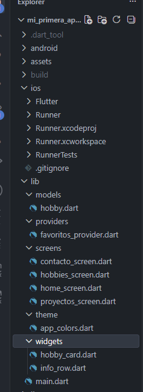
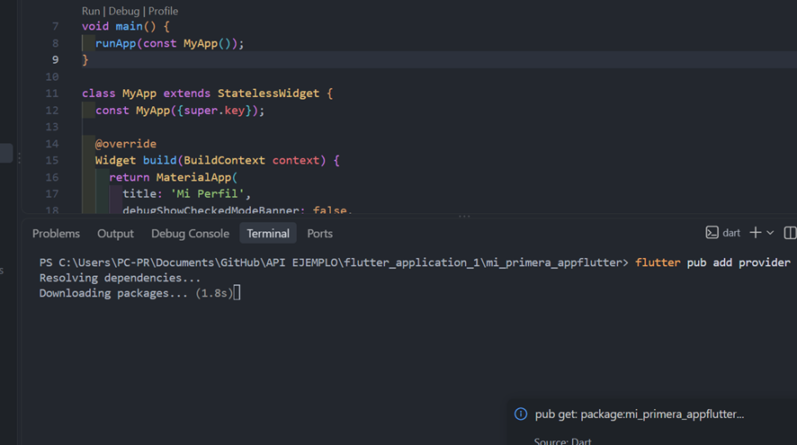
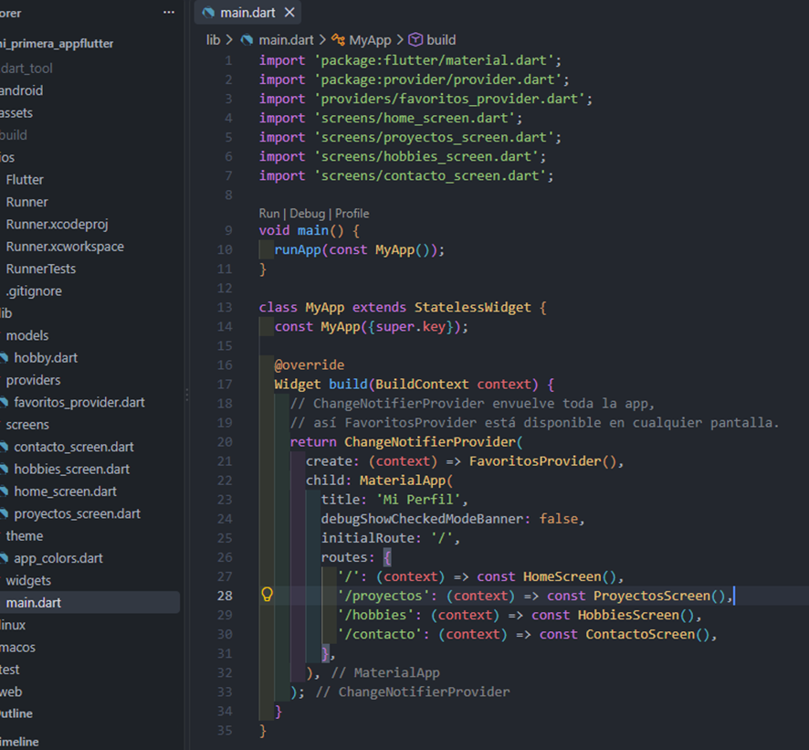
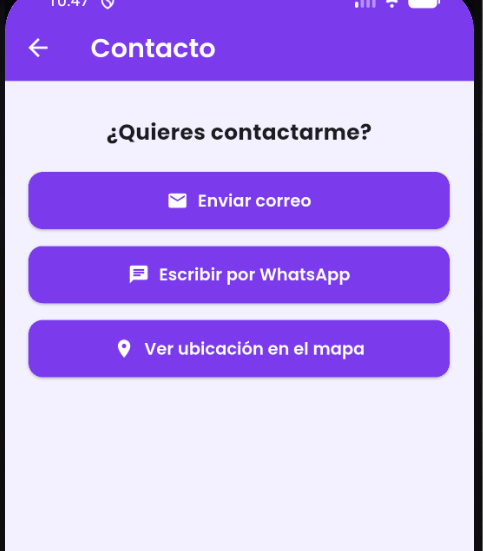

# Mi Perfil Personal - Flutter

## Continuacion Actividad Integradora 1-2-3
#  Mi Primera App en Flutter

Descripción de la aplicación

Continuación de la app de Perfil Personal desarrollada en las actividades anteriores. En esta etapa se incorporó manejo de estado con Provider, se reorganizó el código en carpetas según su responsabilidad y se crearon widgets reutilizables.

Objetivo

Aplicar manejo de estado mediante Provider, mejorar la organización del proyecto en archivos y carpetas, y crear componentes visuales reutilizables.

Funcionalidades principales
Perfil personal con foto, datos de contacto y biografía.
Lista de proyectos personales (ListView).
Grid de hobbies con sistema de favoritos administrado por Provider.
Pantalla de contacto con enlaces funcionales (correo, WhatsApp, mapa).
Contador de favoritos visible en la pantalla principal, actualizado automáticamente al cambiar un favorito en otra pantalla.
Tecnologías y paquetes utilizados
Flutter / Dart
google_fonts
url_launcher
provider

Explicación del Provider implementado

Se implementó FavoritosProvider, una clase que extiende ChangeNotifier y administra la lista de hobbies junto con su estado de favorito.

ChangeNotifier: permite que la clase notifique cambios a quienes la estén escuchando.
notifyListeners(): se llama dentro de toggleFavorito() cada vez que se marca o desmarca un favorito, avisando a toda la app del cambio.
ChangeNotifierProvider: envuelve el MaterialApp en main.dart, haciendo disponible el FavoritosProvider en cualquier pantalla.
Consumer: se utiliza en HobbiesScreen (para mostrar y modificar la lista de favoritos) y en HomeScreen (para mostrar el contador de favoritos actualizado en tiempo real).
Esto demuestra que un cambio hecho en la pantalla de Hobbies (marcar o desmarcar un favorito) se refleja automáticamente en la pantalla de Inicio, sin necesidad de pasar datos manualmente entre pantallas.

Widgets reutilizables creados
HobbyCard (widgets/hobby_card.dart): tarjeta que representa un hobby dentro del GridView, mostrando su ícono, nombre y botón de favorito.
InfoRow (widgets/info_row.dart): fila reutilizable de ícono + texto, usada para mostrar los datos de contacto en la pantalla principal.
Modelo de datos

Se creó la clase Hobby (models/hobby.dart), que representa cada hobby con sus propiedades: nombre, ícono y estado de favorito.

Instrucciones para ejecutar el proyecto
Clonar el repositorio:
   git clone https://github.com/tu-usuario/tu-repositorio.git
   cd tu-repositorio
Instalar las dependencias:
      flutter pub get
Ejecutar la aplicación:
   flutter run

Instalacion de PROVIDER
 
•	ChangeNotifier: la clase base que hace que este objeto pueda "avisar" cuando algo cambia
•	notifyListeners(): el método que dispara el aviso — se llama cada vez que cambias un dato importante
•	Los getters (favoritos, cantidadFavoritos) permiten que cualquier pantalla consulte datos calculados sin duplicar lógica
•	Se agregó el import 'package:provider/provider.dart';
•	Se agregó el import del FavoritosProvider
•	El MaterialApp ahora está envuelto por ChangeNotifierProvider, con create: (context) => FavoritosProvider() — esto "crea" el provider una sola vez y lo comparte con toda la app

   Pantalla principal

Pantalla  Proyectos

Pantaslla de hobbies

Pantalla de contacto

   Autor

Sebastian Avila
